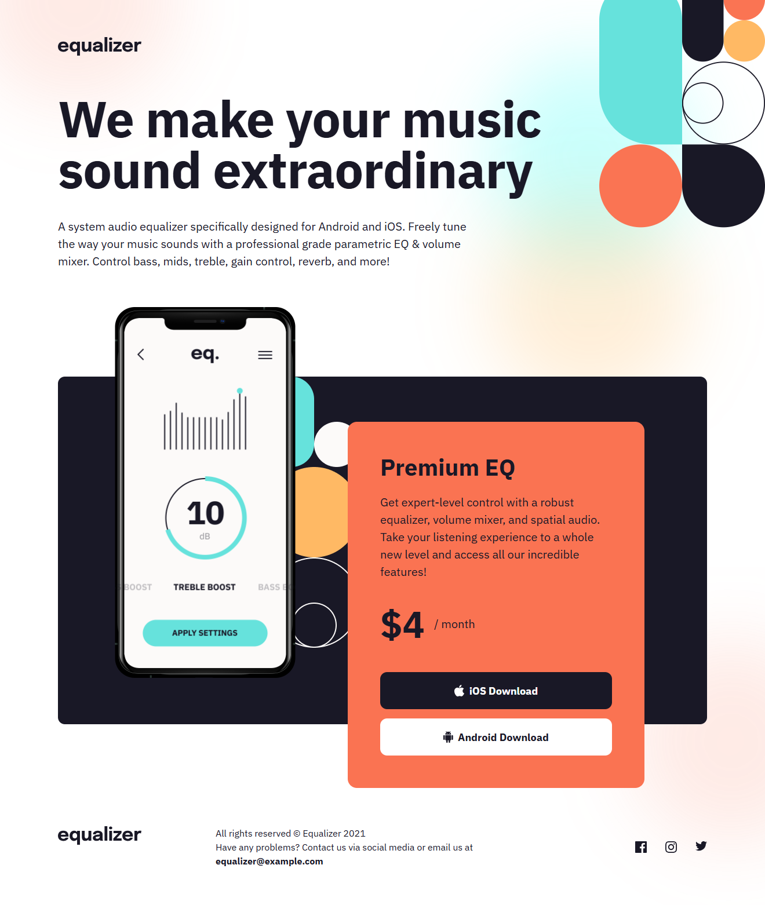

# Frontend Mentor - equalizer landing page

This is a solution to the [Equalizer landing page](https://www.frontendmentor.io/challenges/equalizer-landing-page-7VJ4gp3DE). Frontend Mentor challenges help you improve your coding skills by building realistic projects.

## Table of contents

- [Overview](#overview)
  - [The challenge](#the-challenge)
  - [Screenshot](#screenshot)
  - [Links](#links)
- [My process](#my-process)
  - [Built with](#built-with)
  - [What I learned](#what-i-learned)
- [Author](#author)

## Overview

### The challenge

Your users should be able to:

- View the optimal layout depending on their device's screen size
- See hover states for interactive elements

### Screenshot

### Links

- Solution URL:
- Live Site URL:

## My process

### Built with

- Semantic HTML5 markup
- Tailwind
- Flexbox
- CSS Grid
- Mobile-first workflow

### What I learned

This challenge is a little too easy.

## Author

- Email: rakotonirainyriija@gmail.com
- Facebook: https://web.facebook.com/jair.rakoto.3/
